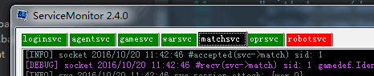

# 方便的服务器进程管理器


# 基本功能

启动参数设置

工作目录设置

打开进程目录

日志搜索

# 特性

## 批量启动,手动启动

一键启动所有服务器

对单个服务器可以设置手动启动不跟随一键启动

## 挂接命令行实现"编译并运行"

使用golang的服务器

在进程同目录准备"进程名_Build.bat"批处理, 填入如下参数

```bat
set GOPATH=GOPATH目录
go install -v 进程名
```

在tab的日志中, 点击右键, 选择"编译"或"编译并运行"

如果编译成功, 将马上运行进程, 否则将停止运行批处理


## 日志自定义加色
编辑color.json, 每一行日志的颜色匹配优先度从高到低

使用方法:

	将color.json与ServiceMonitor.exe在同目录

## 进程状态颜色标记

进程运行时, 自动变绿

进程崩溃时, 自动变红


# 备注

感觉不错请star, 谢谢!

博客: http://www.cppblog.com/sunicdavy

知乎: http://www.zhihu.com/people/sunicdavy

bug,特性提交: https://github.com/davyxu/ServiceMonitor/issues

代码贡献: https://github.com/davyxu/ServiceMonitor/pulls

